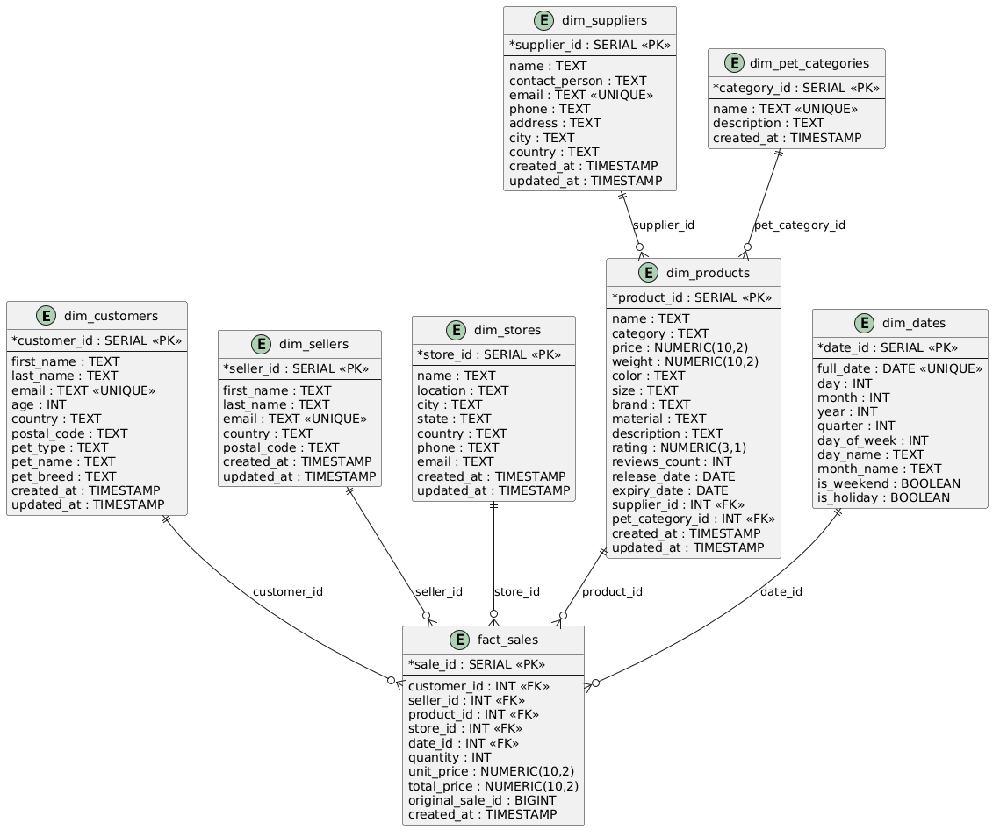

# BigDataSnowflake
Анализ больших данных - лабораторная работа №1 - нормализация данных в снежинку

Одна из задач data engineer при работе с данными BigData трансформировать исходную модель данных источника в аналитическую модель данных. Аналитическая модель данных позволяет исследовать данные и принимать на основе полученных данных решения. Классическими универсальными схемами для анализа данных являются "звезда" и "снежинка". В лабораторной работе вам предстоит потренироваться в трансформации исходных данных из источников в модель данных снежинка.

В данной лабораторной работе я познакомился с тем, как исходные данные из файлов можно преобразовать в аналитическую модель данных типа «снежинка». Основная цель работы заключалась в том, чтобы взять набор неструктурированных данных о покупателях, продавцах, поставщиках, магазинах, товарах и продажах, а затем выделить из него сущности фактов и измерений и реализовать их в PostgreSQL.

Сначала я изучил структуру исходного файла mock_data.csv и других файлов с данными. Всего в было 10 файлов, в каждом по 1000 строк, то есть в результате в таблице mock_data должно быть 10000 записей. Для загрузки данных я использовал PostgreSQL и настроил запуск базы через Docker. Также в docker-compose.yml я указал подключение папки с исходными CSV-файлами и SQL-скриптов, которые выполняются при старте контейнера. Это позволило автоматически создать таблицу, загрузить данные и затем выполнить создание остальных таблиц модели.

После загрузки данных я проанализировал структуру таблицы mock_data и определил, какие сущности можно выделить в отдельные измерения. В результате я создал таблицы dim_customers, dim_sellers, dim_suppliers, dim_stores, dim_pet_categories, dim_products и dim_dates. Для каждой таблицы я подобрал поля, которые логично относятся к конкретной сущности. Например, в таблицу покупателей вошли имя, фамилия, email, возраст, страна, почтовый индекс и данные о питомце. В таблицу товаров я вынес основные характеристики товара: название, категорию, цену, вес, цвет, размер, бренд, материал, описание, рейтинг, количество отзывов и даты выпуска и окончания срока годности. Отдельно я создал таблицу дат, чтобы хранить календарные признаки и использовать их в аналитике.

Затем я реализовал таблицу фактов fact_sales, в которой хранятся ключи на измерения и основные показатели продажи: количество, цена за единицу, общая сумма, а также исходный идентификатор продажи. Такая структура позволяет удобно анализировать продажи по покупателям, продавцам, товарам, магазинам и датам. Благодаря этому можно строить отчеты и делать выборки по разным срезам данных.

После создания структуры я написал SQL-скрипты для заполнения таблиц. Сначала заполнил справочники и измерения, потом на основе исходной таблицы связал данные между собой и заполнил таблицу фактов.

В ходе выполнения работы я лучше понял, чем отличается исходная плоская таблица от аналитической модели данных. Также я закрепил навыки работы с SQL, DDL и DML, научился проектировать таблицы под реальные данные и понял, как организуется загрузка данных через Docker и PostgreSQL. В целом лабораторная работа помогла мне практически разобрать, как из обычных CSV-файлов сделать удобную структуру для последующего анализа.

В результате работы получилась следующая схема базы данных:

